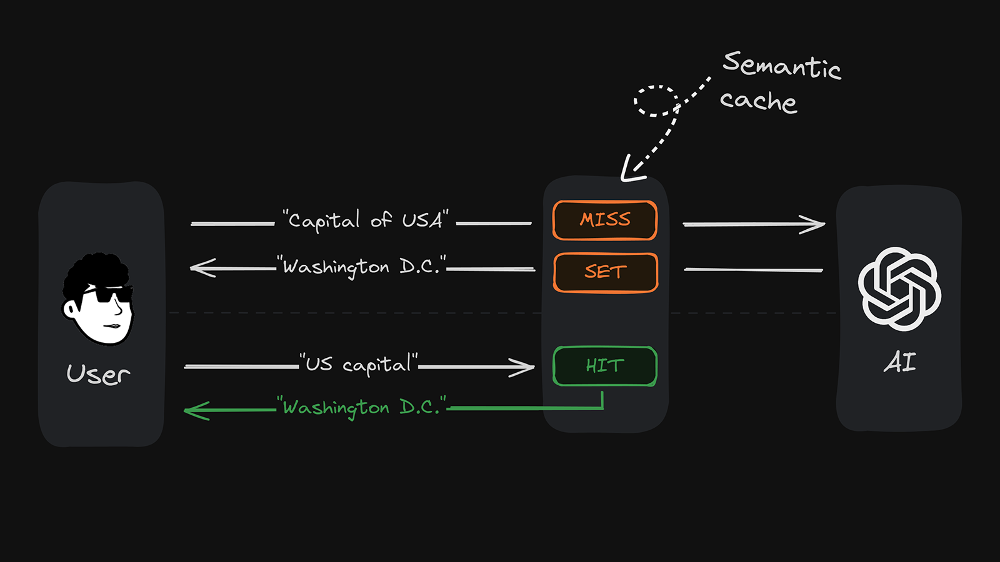

# Semantic Cache

Semantic Cache is a tool for caching natural text based on semantic similarity. It's ideal for any task that involves querying or retrieving information based on meaning, such as natural language classification or caching AI responses. Two pieces of text can be similar but not identical (e.g., "great places to check out in Spain" vs. "best places to visit in Spain"). Traditional caching doesn't recognize this semantic similarity and misses opportunities for reuse.

Semantic Cache allows you to:

- Easily classify natural text into predefined categories
- Avoid redundant LLM work by caching AI responses
- Reduce API latency by responding to similar queries with already cached values



## Highlights

- **Uses semantic similarity**: Stores cache entries by their meaning, not just the literal characters
- **Handles synonyms**: Recognizes and handles synonyms
- **Complex query support**: Understands long and nested user queries
- **Customizable**: Set a custom proximity threshold to filter out less relevant results

## Getting Started

### Prerequisites

- An Upstash Vector database (create one [here](https://console.upstash.com/vector))

### Installation

After creating a vector database, you should install the repository using the following command.

```bash
pip install scaching
```

To use it in your project, you must import it at the beginning of your file:

```python
from upstash_semantic_cache import SemanticCache
 ```

### Setup

First, create an Upstash Vector database [here](https://console.upstash.com/vector). You'll need the `url` and `token` credentials to connect your semantic cache. Important: Choose any pre-made embedding model when creating your database.

> [!NOTE]  
> Different embedding models are great for different use cases. For example, if low latency is a priority, choose a model with a smaller dimension size like `bge-small-en-v1.5`. If accuracy is important, choose a model with more dimensions.

Create a `.env` file in the root directory of your project and add your Upstash Vector URL and token:

```plaintext
UPSTASH_VECTOR_REST_URL=https://example.upstash.io
UPSTASH_VECTOR_REST_TOKEN=your_secret_token_here
```

### Using Semantic Cache

After setting up environment variables and installing the repository, a basic demo can be created like this:

```python

def main():
    # set environment variables
    load_dotenv()
    UPSTASH_VECTOR_REST_URL = os.getenv('UPSTASH_VECTOR_REST_URL')
    UPSTASH_VECTOR_REST_TOKEN = os.getenv('UPSTASH_VECTOR_REST_TOKEN')

    # initialize Upstash database
    cache = SemanticCache(url=UPSTASH_VECTOR_REST_URL, token=UPSTASH_VECTOR_REST_TOKEN, min_proximity=0.7)
    cache.set('The most crowded city in Turkiye', 'Istanbul')
    sleep(1)
    result = cache.get('Which city has the most population in Turkiye?')
    sleep(1)
    print(result)
    
if __name__ == '__main__':
    main() # outputs Istanbul
```

### Using Tests and Examples

In the root folder of the project, you will find tests and examples folders. If you have made changes to the project and want to examine the outputs, you can run the tests and examples using the following commands from the root of the project:

```bash
python3 -m unittest discover tests
```

```bash
python3 -m examples.llm
```

If you added new example files, replace llm with the filename.

### The `minProximity` Parameter

The `minProximity` parameter ranges from `0` to `1`. It lets you define the minimum relevance score to determine a cache hit. The higher this number, the more similar your user input must be to the cached content to be a hit. In practice, a score of 0.95 indicates a very high similarity, while a score of 0.75 already indicates a low similarity. For example, a value of 1.00, the highest possible, would only accept an _exact_ match of your user query and cache content as a cache hit.

## Examples

The following examples demonstrate how you can utilize Semantic Cache in various use cases:

> [!NOTE]  
> We add a 1-second delay after setting the data to allow time for the vector index to update. This delay is necessary to ensure that the data is available for retrieval.

### Basic Semantic Retrieval

```python
cache.set('Capital of Turkiye', 'Ankara')
sleep(1)
result = cache.get('What is the capital of Turkiye?')
sleep(1)
print(result) # outputs Ankara
```

### Handling Synonyms

```python
cache.set('The last champion of European Football Championship', 'Italy')
sleep(1)
result = cache.get('Which country is the winner of the most recent European Football Championship?')
sleep(1)
print(result) # outputs Italy
```

### Complex Queries

```python
cache.set('The largest economy in the world, 'USA')
sleep(1)
result = cache.get('Which country has the highest GDP?')
sleep(1)
print(result) # outputs USA
```

### Different Contexts

```python
cache.set("New York population as of 2020 census", "8.8 million")
cache.set("Major economic activities in New York", "Finance, technology, and tourism")
sleep(1)
result1 = cache.get("How many people lived in NYC according to the last census?")
sleep(1)
result2 = cache.get("What are the key industries in New York?")
sleep(1)
print(result1) # outputs 8.8 million
print(result2) # outputs Finance, technology, and tourism
```

## Contributing

We appreciate your contributions! If you'd like to contribute to this project, please fork the repository, make changes, and submit a pull request.

## License

It is distributed under the MIT License. See `LICENSE` for more information.
